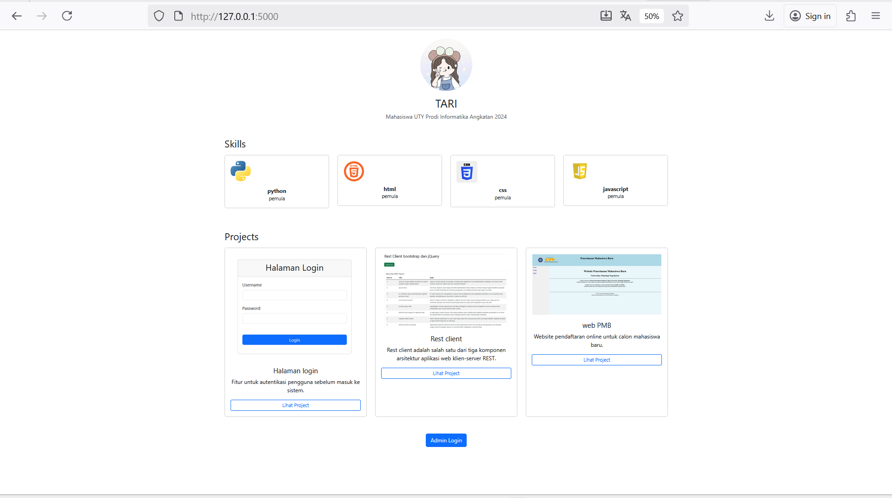
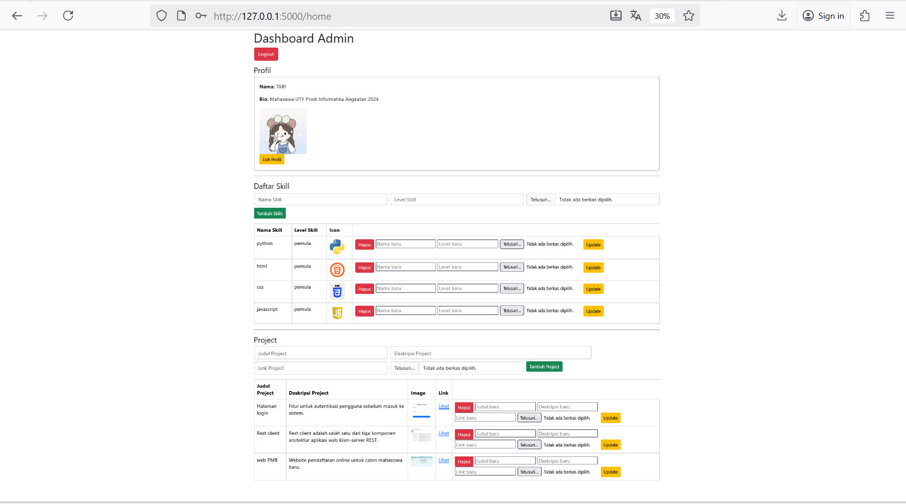

# portofolio-Flask-project

## Deskripsi singkat project
project ini merupakan website portofolio pribadi berbasis Python Flask dan MySQL. aplikasi ini memiliki dua bagian utama:
- halaman publik yang menampilkan profil, daftar skill, dan project
- halaman admin (login) digunakan untuk mengelola data profil, skill, dan project menggunakan CRUD.
website ini dirancang agar memudahkan pengguna dalam menampilkan dan memperbarui data portofolio secara dinamis tanpa perlu mengubah kode secara manual. selain itu, sistem login juga memastikan hanya admin yang memiliki akses untuk melakukan pengolaan data.

## cara menjalankan aplikasi
1. clone repository ini:
   ```bash
   git clone https://github.com/tari42375-prog/portofolio-Flask-project.git
   cd portofolio-Flask-project
2. install semua library yang dibutuhkan:
   pip install -r requirements.txt
3. import database dari file portofolio.sql ke MySQL
4. jalankan aplikasi flask
   python myapp.py
5. buka di browser:
   http://127.0.0.1:5000


## Screenshot
### Halaman Publik


### Halaman Admin (login)


### Halaman Login

